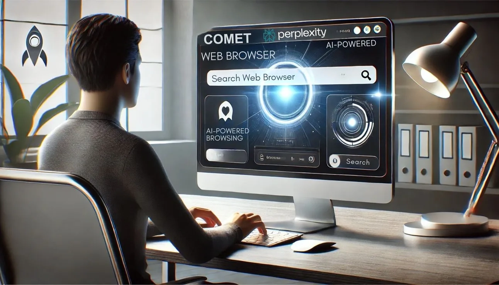
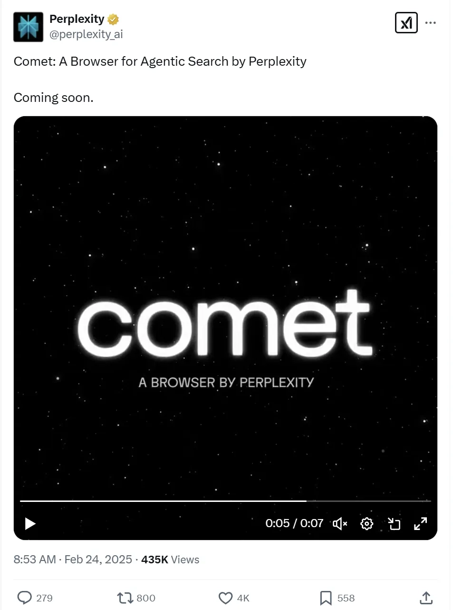

# Perplexity推出Comet：一款AI驱动的全新浏览器

---

你是否厌倦了传统浏览器千篇一律的体验？当AI搜索引擎Perplexity宣布要做浏览器时，整个科技圈都炸了。这家靠重新定义搜索起家的公司，现在要把AI能力直接塞进浏览器里。听起来很酷，但问题来了：在Chrome、Safari这些巨头的地盘上，Perplexity凭什么能杀出一条血路？更重要的是，这款名为Comet的AI浏览器，到底能给我们带来什么不一样的东西？

---

## Comet浏览器：Perplexity的新战场

周一，Perplexity在X平台（就是以前的Twitter）上突然放出了一个注册页面。没有发布会，没有产品演示，就这么简单粗暴地告诉大家：我们要做浏览器了，想试用的赶紧排队。

Perplexity的发言人在接受TechCrunch采访时说："就像我们重新定义了搜索一样，现在我们要重新定义浏览器。"听起来野心不小，但具体怎么个重新定义法？发布日期是什么时候？有哪些杀手级功能？统统没说。

这种"先吊胃口再说"的套路，要么是产品还没做好，要么就是在憋大招。考虑到Perplexity一贯的行事风格，我更倾向于后者。

## 浏览器市场：一场硬仗

说实话，现在做浏览器真不是什么好主意。Chrome占据了全球60%以上的市场份额，Safari在苹果生态里根本没对手，Edge靠着Windows的捆绑也混得不错，就连Firefox这种老牌选手都在苦苦挣扎。

更麻烦的是，AI浏览器这个赛道已经挤满了人。The Browser Company刚推出了Dia，各大传统浏览器也都在疯狂集成AI功能。你能想到的AI辅助搜索、智能摘要、内容生成，人家早就做了。Comet要想脱颖而出，光靠"我们也有AI"是远远不够的。

但Perplexity有一个别人没有的优势：用户基础。2024年10月，Perplexity每周处理的搜索查询量达到了1亿次。这个数字意味着什么？意味着有一大群人已经习惯了用Perplexity的方式获取信息。如果Comet能把这种体验无缝延伸到整个浏览过程，那确实有可能打动这部分用户。

👉 [想体验AI搜索如何改变信息获取方式？先从这里开始](https://pplx.ai/ixkwood69619635)

## Perplexity的扩张野心

成立于2022年的Perplexity，现在估值已经飙到了90亿美元，融资总额超过5亿美元。钱多了，自然要折腾点新东西：

- **2025年2月**：推出深度研究工具，直接对标OpenAI、Google和xAI
- **2025年1月**：发布Android AI助手和AI搜索API

从搜索引擎到浏览器，从移动助手到开发者工具，Perplexity的产品线扩张速度快得吓人。这种打法很像当年的Google：先用一个杀手级产品站稳脚跟，然后疯狂横向扩展。

但快速扩张也带来了麻烦。新闻集团旗下的道琼斯和《纽约邮报》把Perplexity告上了法庭，指控它未经授权抓取和转载内容。《纽约时报》也在2024年10月发出了停止侵权通知。Perplexity当然不承认，还推出了一个内容分成计划，试图和出版商达成和解。但这场官司怎么打，谁也说不准。

## Comet能成吗?

说到底，Comet面临的核心问题就一个：凭什么让用户换浏览器？

Chrome好用是因为它快、稳定、生态完善。Safari好用是因为它和苹果设备深度整合。Edge好用是因为它预装在Windows上。那Comet呢？

如果只是把Perplexity的搜索功能塞进浏览器，那意义不大——Chrome装个插件就能实现。Comet必须提供一些根本性的不同体验，比如：

- 彻底重新设计的信息浏览方式（不再是"打开网页-阅读-关闭"的线性流程）
- 更智能的内容聚合和知识管理
- 真正理解用户意图的AI助手（而不是简单的问答机器人）

当然，这些都是我的猜测。Perplexity到底会怎么做，还得等产品正式发布才知道。但有一点可以肯定：在AI时代，浏览器确实需要一次彻底的重新思考。传统浏览器的设计逻辑来自20年前的互联网，而现在的信息获取方式早就变了。

也许Comet真的能做出点不一样的东西。也许它只是又一个"我也有AI"的平庸产品。但不管怎样，👉 [Perplexity愿意挑战巨头的勇气](https://pplx.ai/ixkwood69619635)，本身就值得尊重。

---

## 写在最后

Comet浏览器的推出，标志着Perplexity从单一的AI搜索工具向综合性AI平台转型。在Chrome、Safari等传统巨头占据主导地位的浏览器市场，Perplexity能否凭借其AI搜索引擎积累的用户基础和技术优势杀出重围，还需要时间验证。但可以确定的是，AI正在重新定义我们与互联网交互的方式，而Comet可能只是这场变革的开始。如果你对AI如何改变信息获取体验感兴趣，不妨先从Perplexity的搜索引擎开始尝试。
